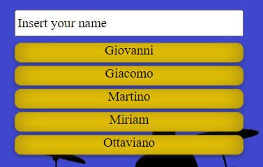
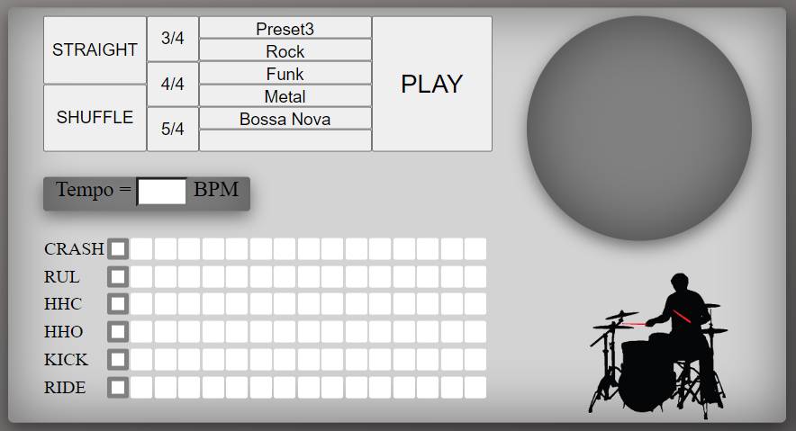
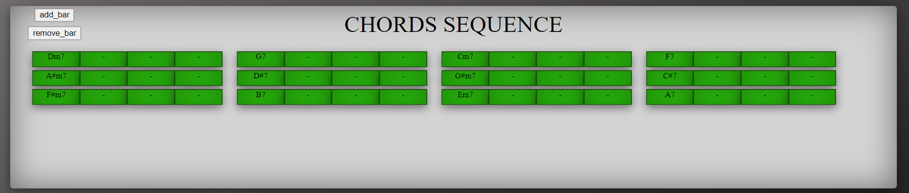
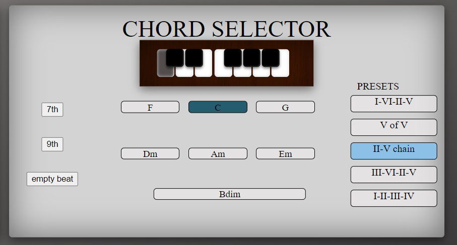
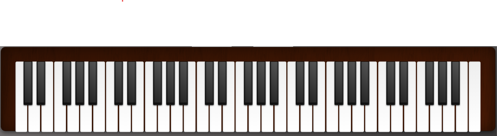
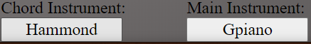
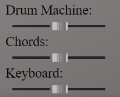
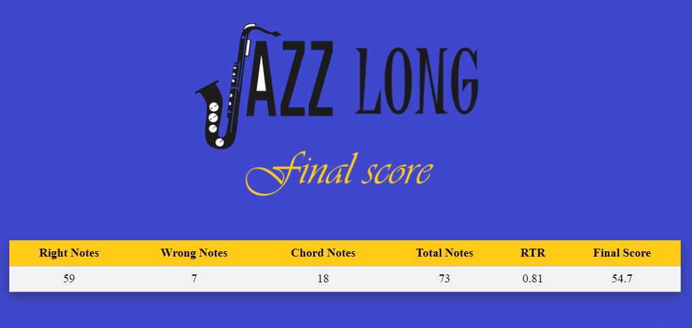
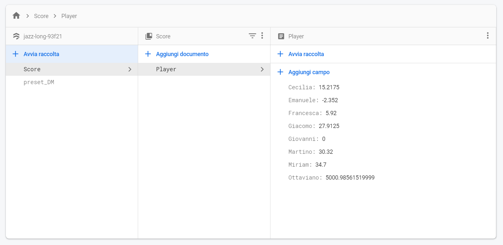
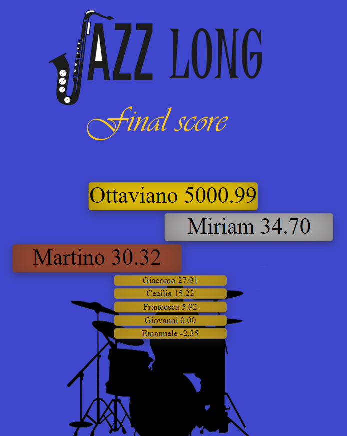

# JAZZ_LONG
## What is Jazz Long

Jazz Long is a single-user, practical web app for learning Jazz improvisation. With Jazz Long you can compete with other player getting better and better and reaching the top of the score.

    
 
   
 Just plug in your MIDI controller, drop your nickname and start playing. You can compose your own backing track with the help of a Drum Machine and a Chord Selector;

 

## How to use Jazz Long
### Plug in your MIDI Device
As the application loads, it connects to any detected MIDI device. First plug your keyboard, and then load/refresh the main page to connect properly.  
### Nice to meet you

Choose your difficulty level (easy, medium, hard) based on your experience. 

If you choose Hard you won't be able to see the right scale that you should play highlighted on the keyboard. 
Insert your name if it's your first time using Jazz Long or pick your name from the list. 

 

### Go crash, boom, bang!

At the top-left of the composition page, there's the Drum Machine.
You can set it by selecting the desired metric for your backing track (3/4, 4/4, 5/4), choose also if you want your rhythm to be shuffled or straight. Have a look at our pre-compiled presets or do it by yourself clicking on the white squares, you will see the squares in the stroke selector go green. Press "Play" to hear what it sounds like. The round visualizer, or "radar" will help you see the rhythmic structure in polar coordinates. 

   

### Beautiful Harmonies

At the bottom of the page lies your complete partiture. Press "add bar" or "remove bar" to adjust its the length. 

 
 
Click on a single beat to assign it a chord, that you can find in the chord selector on your right. 
Use the piano keys to select a reference key and the compatible chords will appear just below. Alternatively, click on a preset, they are made out of the most popular chord progressions in Jazz.

  

 

### Tickle those ivories

When you're done composing, it's time to play! Click "NEXT" to be redirected to the following section and you can improvise on your MIDI keyboard while the track is being played.

**(Remember to choose the zoom that better fits your type of screen!)**

  

Choose your instrument between grand piano, Hammond organ and acoustic guitar.

 

  
You can set the volume sliders choosing the best mix for the backing track and your improvisation.

    

The app will automatically detect the right notes and the errors, according to the major scale harmony theory, and your performance will be given a score.
  

 

When you press "END" it will show all the statistics recorded about your current performance.

 
 
 

## Great, now what?

 
Your name and your score have been saved on our database. 
From now on just click on your name whenever you want to start Jazz Long.
  
  

Your score will be automatically updated at the end of every session by adding it to your score on the database. Practice makes perfect, compete with all the other players and reach the top of the final score!

 

 

## Where is Jazz Long
For the best experience we strongly recommend downloading the app. However, Jazz Long is hosted online at the following link: https://zioTino96.github.io 

Here you can find the video presentation of our work: https://youtu.be/2y9JGPbGHlw

Wanna know more about the structure of the code? Take a glance at the file CodeMap.pdf

## Who is Jazz Long
JL (Jack Long)
T (Tino)
O (Orland)
C (Ceci)

## Have Fun!
